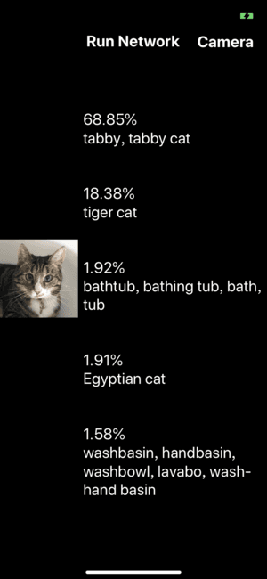

# neural_network_on_ios
Running neural network on IOS(version 10.0 or newer) use GPU (support Keras model)

此库为IOS(版本 >= 10.0)上调用MetalPerformanceShaders和Metal API，在GPU上运行神经网络。当前支持转换keras模型
## Features
 - Use GPU running neural network, improve performance and save more phone battery.
 - Support keras model

## 2019-01-13 V0.1
 - 支持keras图片分类模型转换,支持keras官方模型： [Mobilenet](https://keras.io/applications/#mobilenet)\ [MobilenetV2](https://keras.io/applications/#mobilenetv2)\ [Xception](https://keras.io/applications/#mobilenetv2)
 - 支持keras [layer列表](https://github.com/luozhiping/neural_network_on_ios/blob/master/Document/layer_list.markdown)
 - V0.1 support keras imageclassfication model: [Mobilenet](https://keras.io/applications/#mobilenet)\ [MobilenetV2](https://keras.io/applications/#mobilenetv2)\ [Xception](https://keras.io/applications/#mobilenetv2)
 - V0.1 support keras [layer list](https://github.com/luozhiping/neural_network_on_ios/blob/master/Document/layer_list.markdown)

## 使用说明 Quick Start

### 1.打开example （my xcode version: 10.1）Use example
open and run SimpleMobile.xcodeproj



### 2.转换keras模型 Convert keras model
#### 2.1转换官方模型 Convert keras official model
```shell
python convert_keras.py --network-path ./network.json --weights-path ./weights.bin --model mobilenet
--network-path 模型结构文件，必须为.json结尾
--weights-path 模型weights文件，必须为.bin结尾
--model 可选择mobilnet\mobilenetv2\xception
```

#### 2.2转换自己训练好的模型 Convert my own model
``` python
from convert_weights import *
network = my_model.to_json()
network_file = open(args.network_path, 'w')
network_file.write(network)
network_file.close() #保存网络结构json文件

weights = convert_weights(my_model)
weights = array(weights, 'float32')
weights_file = open(args.weights_path, 'wb')
weights.tofile(weights_file)
weights_file.close()  #调用example/python/convert_weights方法，转换weigths
```
注：自己训练的keras模型仅支持[layer列表](https://github.com/luozhiping/neural_network_on_ios/blob/master/Document/layer_list.markdown)中支持的layer（layer支持会持续更新）
ps: my own model only support some layer in [layer list](https://github.com/luozhiping/neural_network_on_ios/blob/master/Document/layer_list.markdown)
### 3.加载模型 load model
``` swift
let Net = Model.init(networkFileName: "network", weightFileName: "weights") //加载模型文件network.json weights文件weights.bin .load model file network.json, weights file weights.bin
Net.printNetwork() //打印模型结构 print model construction
```
### 4.预测 do inference
``` swift
let inputImage = ImageData(imageFileName: "Floortje", device: device!, fileExtension: "png")
Net.predict(input: inputImage, device: device)  //see example for more detail

// predict会返回一个[Float],是输出的概率数组
// predict return [Float], which is Probabilities array
```

### 5.备注 Some issue
- my environment
    - python 3.6.3
    - Keras-2.2.4
    - tensorflow 1.13.0-dev20181205
    - xcode 10.1
- ToDo
    - Support more keras model and layers

### Reference
Github: A neural network toolkit for Metal [https://github.com/hollance/Forge](https://github.com/hollance/Forge)